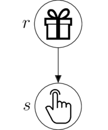
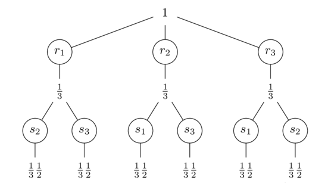
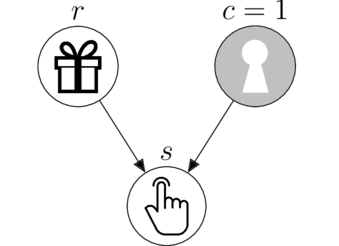
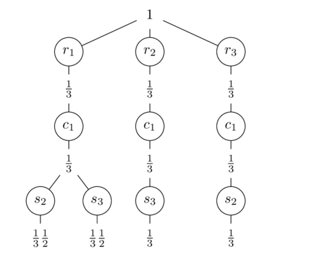

# Honest Beliefs

**La ciencia es una institución humana que aspira alcanzar la verdad, esto es de formular proposiciones que valgan para todas las personas, tanto intercultural como intersubjetivamente.**
Las ciencias formales validan sus proposiciones mediante teoremas, resultados derivados de aplicar las reglas internas a un sistema axiomático cerrado.
Las ciencias empíricas deben validar sus proposiciones dentro de sistemas abiertos, lo que impone siempre un grado de incertidumbre asociada.
**¿Cuál es entonces la fuente de validez del conocimiento empírico?**

Supongamos que tenemos 3 cajas y sabemos que detrás de una hay un regalo.
Una posible **distribuión de creencias** es:

lo que representa una preferencia parcial por la caja del medio.
Pero si de verdad no tenemos ninguna información respecto de dónde está el regalo, fácilmente vamos a llegar a un acuerdo respecto de que no hay motivos para tener preferencia por ninguna de las opciones.

**Este tipo de distribuciones de creencias, que permiten el acuerdo intersubjetivo, la vamos a llamar _creencia honesta_**.
Las creencias honestas son las que maximizan incertidumbre dada la información disponible.
En este caso, en el que no tenemos información previa, la obtuvimos dividiendo la creencia en partes iguales.
¿Pero cómo hacemos para actualizar las creencias de forma honesta cuando recibimos nueva información?

Aquí recibimos el dato de que el regalo no está en la caja del medio, lo que nos permite asignar creencia 0 a esa caja.
Para actualizar el resto de las cajas necesitamos interpretar qué nos está diciendo la pista.
Supongamos que la pista depende de dónde está el regalo, nos dice dónde no está el regalo.
Esto lo podemos representar con el siguiente modelo causal.

Siguiendo con el principio de indiferencia que usamos para definir una creencia honesta, **dividimos la creencia en partes iguales por los caminos del modelo causal** para definir la creencia honesta de ellos.

Primero dividimos la creencia sobre el regalo en partes iguales, y luego volvemos a dividir la creencia sobre la pista en partes iguales.
Nuestra **creencia conjunta honesta** a priori es

Es honesta porque maximiza la incertidumbre dada la información disponible hasta el momento: el modelo causal.
Y es conjunta porque es la creencia de que ocurran simultaneamente ambas variables, $\text{Creencia}(r,s)$.

## Teoría de la probabilidad

**Las reglas de la probabilidad** han sido derivadas formalmente a partir de una gran cantidad de sistemas axiomáticos conceptualmente distintos e independientes entre si, lo cual es uno de los punto fuertes a su favor.
Pero quizás más importante es que ellas **garantizan maximizar la incertidumbre dada la información empírica (datos) y formal (modelos causales)**.

La teoría de la probabilidad tiene sólo dos reglas: la regla de la suma y la regla del producto.
La primera computa la creencia de una variable integrando en partes iguales la creencia conjunta.
Por ejemplo, la creencia honesta sobre los regalos nuevamente es 1/3

$$\text{Creencia}(r_i) = \sum_j \text{Creencia}(r_i, s_j) = 1/3$$

y sobre la pista también

$$\text{Creencia}(s_j) = \sum_i \text{Creencia}(r_i, s_j) = 1/3$$

La segunda regla es la que nos permitirá cumplir el objetivo que nos habíamos propuesto, actualizar la creencia sobre el regalo luego de haber visto la pista.
Consiste en quedarnos con la creencia conjunta a priori que es consistente con el dato, $\text{Creencia}(r_i, s_2)$.

Como **la creencia que sobrevive** es ahora nuestra nueva creencia total, la normalizamos (en partes iguales) para que vuelva a sumar 1

$$\text{Creencia}(r_i| s_2) = \frac{\text{Creencia}(r_i, s_2)}{\text{Creencia}(s_2)} = 1/2$$

Luego de ver la pista nuestra nueva creencia honesta dado el modelo causal es, 

La concusión a la que llegamos coincide con la intuición de la mayoría.
Pero este resultado depende del modelo causal elegido.

## Monty Hall

Supongamos que la pista, además de no poder coincidir con la posición del regalo, tiene prohibida una de las puertas.
Esto lo podemos representar con el siguiente modelo causal.

Este modelo es más conocido como el Monty Hall.
Para simplificar el problema, suponemos que la puerta 1 es la que queda cerrada, $c=1$.
Supongamos que en este contexto recibimos una pista.

¿Cómo hacemos para actualizar las creencias de forma honesta?
Como hicimos antes, maximizamos la incertidumbre dividiendo las creencias por los caminos del modelo causal de modo de definir la creencia conjunta honesta.

Cuando el regalo está detrás de la puerta 1, $r_1$, podemos recibir una pista tanto en la puerta 2, $s_2$, como en la puerta 3, $s_3$.
Si el regalo está en la puerta 2, $r_2$, la pista sólo puede señalar la puerta 3, $s_3$.
Así definimos la siguiente creencia honesta conjunta (y sus marginales).

Para actualizar nuestra creencia nuevamente nos quedamos con la creencia a priori que es compatible con los datos.

Que normalizado en partes iguales para que sume 1 queda como

Esta respuesta es diferente a la que obtuvimos con el primer modelo causal.
Sin embargo, **ambas comparten la propiedad de ser la distribución de creencias que maximiza la incertidumbre dada la evidencia formal (modelo causal) y empírica (datos), lo que hace que sean proposiciones que valgan para todas las personas, tanto intercultural como intersubjetivamente**.

