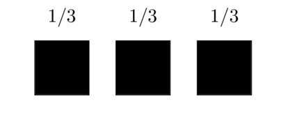
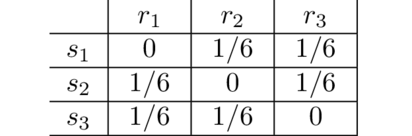
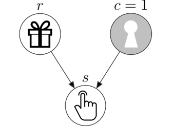
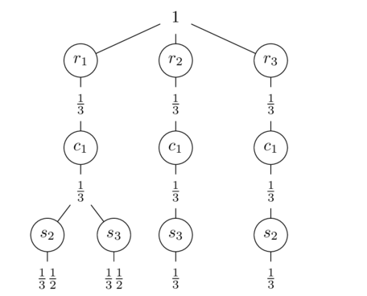

Science is a human institution that aspires to reach the truth, formulating universally valid propositions.
Formal sciences validate their propositions by means of theorems, derived from applying the internal rules of a closed axiomatic system.
Empirical sciences must validate their propositions within open systems, which always impose a degree of associated uncertainty.
**Which is therefore the source of validity for empirical knowledge?**

My people say that "the only truth is reality", and if someone wants to explain you economics and you don't understand then they are lying to you.
What we call empirical science is neither truth nor reality, it is merely a discourse about reality that claims the status of truth.
The best we can do is to work honestly to reach **intersubjective agreements that can be accepted by all members of our and any other community**.

Suppose we have 3 boxes and we know that behind one of them there is a gift.
One possible **belief distribution** is:

which represents a relative preference for the middle box.
But if we really don't have any information regarding where the gift is, there is no reason to have a preference for any of the options, which will undoubtedly make us agree with the following belief distribution.

**This type of belief distributions, which allow intersubjective agreement, we will call it _honest belief_**.
Honest beliefs are the ones that maximize uncertainty, remaining consistent with the available information.
In this case, having no prior information, we just divide the belief equally.
This is an old principle known as "indifference".
But how do we update beliefs honestly when we receive new information?

Here we receive the data that the gift is not in the middle box, which allows us to assign belief 0 to it.
However, to update the belief of the rest of the boxes we need to interpret what the hint is telling us.
Suppose the clue depends on where the gift is, it can only tell us where the gift is not.
We can represent this relationship with the following causal model.

Following the principle of indifference on which we relied earlier, we now divide our belief equally among the forks of the causal model paths.

First we divide the belief among the possible gifts, $r$, and then we divide the belief again among the possible hints, $s$.
Our joint honest belief (prior to see the data) is, 

It is honest because it maximizes uncertainty given the information available so far: the causal model.
And it is joint because it is the belief about a simultaneous occurrence of both variables, $\text{Belief}(r,s)$.

## Probability theory

The rules of probability have been derived from a large number of axiomatic systems, conceptually distinct and independent of each other, which is a strong point in their favor.
But perhaps more importantly, they **ensure maximization of uncertainty given empirical and formal information (data and causal models)**.

Probability theory has only two rules: the sum rule and the product rule.
The first one computes the belief of a single variable by integrating in equal parts the joint belief distribution.
For example, the honest belief about the gifts is again 1/3,

$$\text{Belief}(r_i) = \sum_j \text{Belief}(r_i, s_j) = 1/3$$

And the same applies to the hint variable.

$$\text{Belief}(s_j) = \sum_i \text{Belief}(r_i, s_j) = 1/3$$

The second rule is the one that allow us to fulfill the objective we had set ourselves: update the belief about the gift after having seen the hint.
It consists of preserving the joint belief that is consistent with the data, $\text{Belief}(r_i, s_2)$.

Since the surviving belief is now our new total belief, we normalize it (in equal parts) so that overall it adds up to 1.

$$\text{Belief}(r_i| s_2) = \frac{\text{Belief}(r_i, s_2)}{\text{Belief}(s_2)} = 1/2$$

After seeing the hint, our new honest belief given the causal model is, 

The conclusion we reached coincides with our intuition.
But this result depends on the chosen causal model.

## Monty Hall

Suppose the hint, not only cannot match the position of the gift, but also has a forbidden option.
This relationship can be represented by the following causal model.

This model is better known as the Monty Hall game.
To simplify the problem, we assume that box 1 is the one that remains closed, $c=1$.
Suppose that in this context we receive the following hint.

How should we honestly update our beliefs?
As we did before, we maximize uncertainty by splitting beliefs along the forks of the causal model paths.

When the gift is behind box 1, $r_1$, we can receive the hint in both box 2, $s_2$, and box 3, $s_3$.
If the gift is in box 2, $r_2$, the hint can only point to box 3, $s_3$.
In this way we define the following joint honest belief (and its marginals).

To update our belief we again preserve only the belief that is compatible with the data.

And then normalized so that together it adds up to 1 is

This answer is different from the one we obtained with the first causal model.
However, **both share the property of being the distribution of beliefs that maximizes uncertainty given the evidence, formal (causal model) and empirical (data), which makes them propositions that are valid for all people, both interculturally and intersubjectively**.

Science is an intercultural project of intersubjective agreements.
However, the native communities of my region remind me that the agreement must be with the whole Mother Nature, or there is simply no agreement, there is exploitation.
So the truth is that (almost) everything is a lie in this world, because since the emergence of what we call "modern science" a process of irreversible loss of biodiversity has begun.

